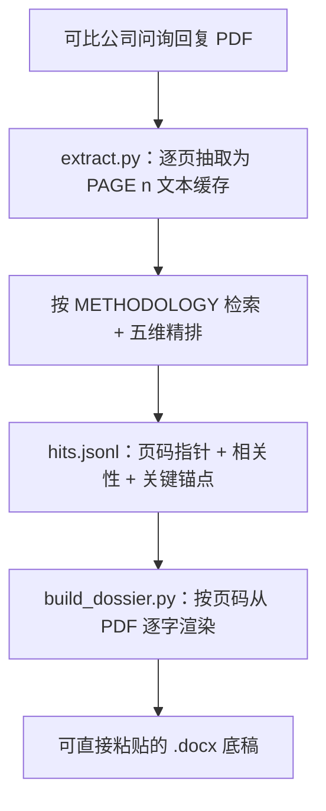

# IPO 问询可比案例底稿生成工具

把可比上市公司的审核问询回复 PDF 丢进去，输出一份可直接粘贴进答卷的 `.docx` 底稿。这是一个 Claude Code 技能：哪些案例可比、哪些段落值得抄，交给模型判断；底稿正文则由脚本逐字从 PDF 落盘，不经过模型改写。

## 背景

投行和证券研究的面试、笔试、实习任务里常见这样一道题：找一家可比上市公司的审核问询回复，逐字抄录关键段落，整理成一份答题底稿。手工做有三个痛点：

- 人工翻 PDF 逐页复制、粘贴、排版，一份要花三到五小时。
- 直接把整份 PDF 塞进大模型，token 消耗高，而且模型容易改写原文措辞，引用就不可信了。
- 没有统一的判断标准，不同人产出的底稿质量参差不齐。

这个工具把判断和输出彻底拆开：模型只决定哪些案例可比、哪些段落值得抄，底稿里的每一段引用都由脚本逐字从源 PDF 读出，不经过模型管道。

## 看效果


`examples/` 目录里有一份完整的真实底稿成品（[底稿_功率器件代工毛利率改善措施_2025-03-14.docx](examples/底稿_功率器件代工毛利率改善措施_2025-03-14.docx)）和对应的 `sample_hits.jsonl`。建议先打开这份 docx 看看产物长什么样，再回头看下面的设计。

## 设计要点

### 原文不过模型

- PDF 正文由 `extract.py`（PyMuPDF）一次性抽取成带 `[PAGE n]` 标记的 `.txt` 缓存。
- 模型只通过页码指针引用原文，从不把整份 PDF 塞进上下文；底稿渲染时由 `build_dossier.py` 按页码直接从 PDF 逐字读取，不经过模型。
- 因此 token 消耗与底稿篇幅解耦——一份十页底稿大约几千 token，而不是几十万，引用也保证逐字一致。

### 召回与精排两段分离

- 召回阶段从问题原文拆出限定词，做同义和口径扩展，机械 grep 扫描缓存，高召回、不取舍。
- 精排阶段逐个候选按五维 rubric 打分（同问询实质、真问询先例、产品行业可比、口径一致、可借鉴），每项 0–2 分，达到 7 分且无 0 分项才保留。
- 所有候选（含丢弃的）记录在 `ranking_report.jsonl`，每一步判断都可回溯。

### 脚本确定性渲染 docx

- 结论速览卡：首屏汇总保留案例、精排结论、缺口说明、可直接移植章节。
- 五级溯源：每个案例附公司、轮次、日期、文件、问询页码、回复页码的元信息表。
- 关键锚点高亮：`hits.jsonl` 里标注的逐字短句命中原文后自动标黄。
- 表格三级兜底：`find_tables()` 抽出健康表格转成 Word 真表格；坏表截成高清图片；无表退回段落文本。
- 自动目录：写入 Word TOC 域，在 Word 里右键“更新域”即可生成可跳转目录。

## 工作流



## 怎么用

### 方式一：作为 Claude Code 技能（推荐，不用敲命令）

把整个仓库放进 Claude Code 的技能目录（例如 `~/.claude/skills/ipo-inquiry-dossier`），然后用自然语言跟 Claude 说，例如：

> 我在 `~/Desktop/可比公司pdf` 放了几份问询回复，请按 ipo-inquiry-dossier 技能帮我找可比案例、做一份毛利率分析的底稿。

Claude 会自己读 `SKILL.md`，按方法论完成检索和精排；首次运行时会自动建好 venv 并安装依赖，再调用脚本生成底稿。你全程只需要提供 PDF 和问题，不用手动跑 Python、也不用手动装依赖。

### 方式二：手动运行脚本（可选）

需要的话也可以直接在命令行运行。建议先建一个隔离环境，依赖只有 `pymupdf` 和 `python-docx`：

```bash
python -m venv .venv
# macOS / Linux:
.venv/bin/python -m pip install -r requirements.txt
# Windows:
.venv\Scripts\python.exe -m pip install -r requirements.txt
```

下文 `PY` 即上面 venv 里的解释器（macOS/Linux `.venv/bin/python`、Windows `.venv\Scripts\python.exe`）。把 PDF 放进一个目录，抽取文本缓存：

```bash
PY scripts/extract.py --input 你的PDF目录
```

写好 `hits.jsonl`（格式见 `docs/METHODOLOGY.md`，可参照 `examples/sample_hits.jsonl`）后生成底稿：

```bash
PY scripts/build_dossier.py --input 你的PDF目录 --output 输出目录 --hits 输出目录/hits.jsonl
```

输出文件名形如 `底稿_{主题}_{日期}.docx`。`--input`、`--output`、`--hits` 都可省略，默认分别是 `./input`、`./output`、`./output/hits.jsonl`。脚本只用 `pathlib` 和标准库，Windows、macOS、Linux 一致运行。

## 目录结构

```
ipo-inquiry-dossier/
├── SKILL.md              Claude Code 技能入口（name/description 自动触发）
├── docs/
│   ├── METHODOLOGY.md    方法论唯一事实源（召回、精排 rubric、hits 契约、渲染规则）
│   └── sample.png        示例底稿截图
├── scripts/
│   ├── extract.py        PDF 抽取为 [PAGE n] 文本缓存
│   └── build_dossier.py  hits.jsonl + PDF 渲染为 .docx
├── examples/             样例 hits / 精排报告 / 真实底稿成品
├── requirements.txt      pymupdf, python-docx
└── README.md
```

方法论的完整细节（检索词扩展表、五维 rubric 评分标准、`hits.jsonl` 字段契约、表格三级兜底的具体阈值）都在 [docs/METHODOLOGY.md](docs/METHODOLOGY.md)。
