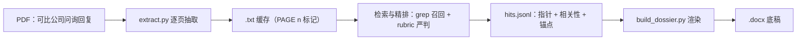

# IPO 问询可比案例底稿生成工具

面向 A 股 IPO 问询答题场景的工具：把可比上市公司的审核问询回复 PDF 丢进去，输出一份可直接粘贴的 `.docx` 答题底稿。模型只负责判断哪些案例可比，底稿正文由脚本逐字落盘，不经过模型改写。

## 背景

投行和证券研究的面试、笔试、实习任务里常见这样一道题：找一家可比上市公司的审核问询回复，逐字抄录关键段落，整理成一份答题底稿。手工做有三个痛点：

- 人工翻 PDF 逐页复制、粘贴、排版，一份要花三到五小时。
- 直接把整份 PDF 塞进大模型，token 消耗高，而且模型容易改写原文措辞。
- 没有统一方法论，不同人产出的底稿质量参差不齐。

这个工具把判断和输出拆开：模型只判断哪些案例可比、哪些段落值得抄，底稿渲染全部交给确定性脚本，原文逐字落盘。

## 设计要点

### 原文不过模型

- PDF 正文由 `extract.py`（PyMuPDF）一次性抽取为带 `[PAGE n]` 标记的 `.txt` 缓存。
- 模型通过页码指针引用原文，不把整份 PDF 塞进上下文；渲染时 `build_dossier.py` 按页从 PDF 逐字读取，不经过模型管道。
- token 消耗与底稿篇幅解耦，一份十页底稿大约几千 token，而不是几十万。

### 召回到精排的两段检索

- 召回阶段从问题原文拆关键词，做同义和口径扩展，用 `grep -i` 扫描缓存，高召回不取舍。
- 精排阶段用五维度 rubric（同问询实质、真先例、产品可比、口径一致、可借鉴），每项 0 到 2 分，达到 7 分且无 0 分项才保留。
- 所有候选（含丢弃的）记录在 `ranking_report.jsonl`，可回溯每一步判断。

### 脚本渲染 docx

- 速览卡：首屏汇总保留案例、精排结论、缺口说明、可直接移植章节。
- 关键锚点高亮：`hits.jsonl` 里的短文本指针命中原文后自动标黄。
- 表格三级兜底：`find_tables()` 抽出健康表格转成 Word 真表格，坏表转高清截图，无表退回段落文本。
- 自动目录：写入 Word TOC 域，右键更新域即可跳转。

### 跨平台

- 纯 `pathlib` 加 Python 标准库，Windows、macOS、Linux 一致运行。
- 路径全部通过 CLI 参数传入，默认相对当前工作目录，无硬编码。

## 工作流



## 快速开始

克隆仓库：

```bash
git clone https://github.com/hhaa134323/ipo-inquiry-dossier
cd ipo-inquiry-dossier
```

创建虚拟环境（macOS / Linux）：

```bash
python -m venv .venv
source .venv/bin/activate
```

创建虚拟环境（Windows PowerShell）：

```powershell
python -m venv .venv
.venv\Scripts\Activate.ps1
```

安装依赖：

```bash
pip install -r requirements.txt
```

抽取 PDF 文本缓存：

```bash
python scripts/extract.py --input /path/to/pdfs
```

完成检索定位、写好 `hits.jsonl` 后生成底稿：

```bash
python scripts/build_dossier.py --input /path/to/pdfs --output ./my_dossier --hits ./my_dossier/hits.jsonl
```

输出文件名形如 `底稿_{主题}_{日期}.docx`。检索策略、精排 rubric、`hits.jsonl` 字段契约和渲染规则的完整说明见 [docs/METHODOLOGY.md](docs/METHODOLOGY.md)。

## 目录结构

```
ipo-inquiry-dossier/
├── SKILL.md              Claude Code Skill 入口
├── docs/
│   └── METHODOLOGY.md    方法论事实源（检索、精排、渲染规范）
├── scripts/
│   ├── extract.py        PDF 转 [PAGE n] 文本缓存
│   └── build_dossier.py  hits.jsonl + PDF 转 .docx
├── examples/             样例数据与演示底稿
├── requirements.txt
└── README.md
```

`SKILL.md` 是 Claude Code 自动触发的入口，`name` 与 `description` 匹配使用场景后激活技能；其他工具可以直接调用 `scripts/` 下的 CLI。

## 示例

`examples/` 目录下有一份真实底稿成品和对应的 `hits.jsonl`。建议先打开 `.docx` 看产物长什么样，再回头看代码与工作流。

## 许可证

MIT
