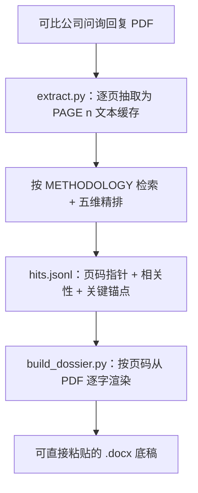

# IPO Inquiry Dossier

中文名 **可比案例底稿** —— 检索可比上市公司的问询先例，逐字取证，整理成可直接粘贴进答卷的底稿。

**把投行人工要做三到五小时的可比案例底稿，交给 agent 几分钟跑完——而且比手工更可靠。**

你给它几份问询回复 PDF 和一道题，它检索可比上市公司的问询先例、按统一标准精排、整理成一份可直接粘贴进答卷的 `.docx` 底稿。每一句引用都和原 PDF 一字不差、标好出处页码，不会被 AI 改写。

## 为什么比人工好

| | 人工 | 这个技能 |
|---|---|---|
| 耗时 | 一份三到五小时 | 几分钟 |
| 引用准确 | 手抄易错漏 | 脚本按页码逐字落盘，一字不差 |
| 判断标准 | 因人而异 | 统一五维 rubric，每步可回溯 |
| token 成本 | — | 原文不进模型，与底稿篇幅解耦 |

关键在于把**判断**和**取证**拆开：AI 只决定“哪些案例可比、抄哪几段”，而底稿正文由脚本按页码从源 PDF 逐字读出。既拿到 AI 的判断效率，又保住人工抄录的引用可信度。

## 给谁用

投行 / 证券研究的**面试、笔试、实习任务**里常见这道题：找一家可比上市公司的审核问询回复，逐字抄录关键段落，整理成答题底稿。手工做费时、易出错、质量还看人。这个技能把这个流程变成可复用、可回溯的一键流程。

## 看效果


`examples/` 里有一份完整成品（[底稿_功率器件代工毛利率改善措施_2025-03-14.docx](examples/底稿_功率器件代工毛利率改善措施_2025-03-14.docx)）、对应的 `sample_hits.jsonl`（精排结果输入示范）和 `sample_ranking_report.jsonl`（含被丢弃候选的打分回溯）。建议先打开这份 docx 看产物长什么样。

## 怎么用

### A. 作为 Claude Code 技能（推荐）

把整个仓库放进技能目录：

```bash
git clone https://github.com/hhaa134323/ipo-inquiry-dossier.git ~/.claude/skills/ipo-inquiry-dossier
```

然后用自然语言让 Claude 做事即可，不用敲命令。**触发语**（说到这些会自动用上本技能）：

- “找家可比上市公司的问询回复，帮我做一份毛利率分析的答题底稿”
- “把这几份审核问询回复 PDF 整理成可直接粘贴的底稿”
- “IPO 问询 / 反馈意见、可比案例、底稿”

示例：

> 我在 `~/Desktop/可比公司pdf` 放了几份问询回复，请按 ipo-inquiry-dossier 技能帮我找可比案例、做一份毛利率分析的底稿。

技能会：

1. 调 `extract.py` 把 PDF 逐页抽成 `[PAGE n]` 文本缓存；
2. 按 `docs/METHODOLOGY.md` 召回 + 五维精排，产出 `hits.jsonl`；
3. 调 `build_dossier.py` 按页码逐字渲染出 `.docx` 底稿。

你全程只提供 PDF 和问题，不用手动跑 Python，也不用手动装依赖（见下方「依赖」）。

### B. 其他 coding agent（Codex / Gemini CLI / Cursor / OpenCode…）

把这个仓库链接丢给 agent，让它用本技能：

```text
https://github.com/hhaa134323/ipo-inquiry-dossier
```

能读 GitHub / 本地文件的 agent，应从 **`SKILL.md`** 读起，按需再加载 `docs/METHODOLOGY.md` 和 `scripts/`。有文件系统权限的 agent 也可以照 A 的方式把仓库装进自己的技能目录。

### C. 手动跑脚本（可选）

不想用 agent，自己在命令行跑也行。先建隔离环境（依赖只有 `pymupdf`、`python-docx`）：

```bash
python -m venv .venv
# macOS / Linux:
.venv/bin/python -m pip install -r requirements.txt
# Windows:
.venv\Scripts\python.exe -m pip install -r requirements.txt
```

下文 `PY` = 上面 venv 里的解释器（macOS/Linux `.venv/bin/python`、Windows `.venv\Scripts\python.exe`）：

```bash
# 1. 抽取文本缓存
PY scripts/extract.py --input 你的PDF目录

# 2. 写好 hits.jsonl（格式见 docs/METHODOLOGY.md，可参照 examples/sample_hits.jsonl）

# 3. 生成底稿
PY scripts/build_dossier.py --input 你的PDF目录 --output 输出目录 --hits 输出目录/hits.jsonl
```

输出文件名形如 `底稿_{主题}_{日期}.docx`。`--input`、`--output`、`--hits` 都可省略，默认 `./input`、`./output`、`./output/hits.jsonl`。

## 依赖（首次自动装）

依赖只有 `pymupdf` 和 `python-docx`，**使用者不用手动装**。`SKILL.md` 里写了「首次运行自动建 venv + 装依赖」：agent 第一次跑时会 `python -m venv .venv` 并把依赖装进去，之后统一用该 venv 的解释器跑脚本（跨平台，不引入 uv 之类额外工具）。脚本只用 `pathlib` 和标准库，Windows / macOS / Linux 一致运行。

## Skill 结构

```
ipo-inquiry-dossier/
├── SKILL.md              技能入口（name/description 自动触发；工作流 + 规则）
├── docs/
│   ├── METHODOLOGY.md    方法论唯一事实源（召回、精排 rubric、hits 契约、渲染规则）
│   └── sample.png        示例底稿截图
├── scripts/
│   ├── extract.py        PDF 抽取为 [PAGE n] 文本缓存
│   └── build_dossier.py  hits.jsonl + PDF 渲染为 .docx
├── examples/             成品 docx + hits / 精排报告样例
└── requirements.txt      pymupdf, python-docx
```

技能用**渐进式披露**：agent 先读 `SKILL.md` 拿到全局地图，其余文件按需加载。

| 文件 | 作用 | 何时加载 |
|---|---|---|
| `SKILL.md` | 工作流 + 规则 | 总是（技能触发时） |
| `docs/METHODOLOGY.md` | 方法论唯一事实源 | 召回 / 精排 / 写 hits 时 |
| `scripts/extract.py` | PDF → 文本缓存 | 步骤 1 |
| `scripts/build_dossier.py` | 渲染 .docx | 步骤 3 |
| `examples/` | 成品 + hits 格式样例 | 想看产物或对照格式时 |
| `requirements.txt` | 依赖清单 | 首次装依赖时 |

## 设计要点

### 引用逐字可溯，不被 AI 改写
- PDF 正文由 `extract.py`（PyMuPDF）一次性抽成带 `[PAGE n]` 标记的 `.txt` 缓存。
- AI 只决定“抄哪些”并记下页码指针；渲染时由 `build_dossier.py` 按页码直接从 PDF 逐字读出——引用与原文一字不差，也不进 AI 上下文被改写。
- 顺带的好处：token 消耗与底稿篇幅解耦，一份十页底稿约几千 token，而非几十万。

### 召回与精排两段分离
- 召回：从问题原文拆限定词，做同义 / 口径扩展，机械 grep 扫缓存，高召回不取舍。
- 精排：逐个候选按五维 rubric 打分（同问询实质、真问询先例、产品行业可比、口径一致、可借鉴），每项 0–2 分，达 7 分且无 0 分项才保留。
- 所有候选（含丢弃的）记录在 `ranking_report.jsonl`，每步判断可回溯。

### 脚本确定性渲染 docx
- 结论速览卡 / 五级湯源表 / 关键锚点自动标黄 / 表格三级兜底（真表格→截图→段落）/ 自动目录（Word 右键“更新域”）。

## 工作流



## 引用纪律

- 引用一律逐字落盘，绝不让 AI 改写；
- 每条结论落到“文件 + 页码”；
- 找不到就说找不到，严禁编造。

方法论完整细节见 [docs/METHODOLOGY.md](docs/METHODOLOGY.md)。
