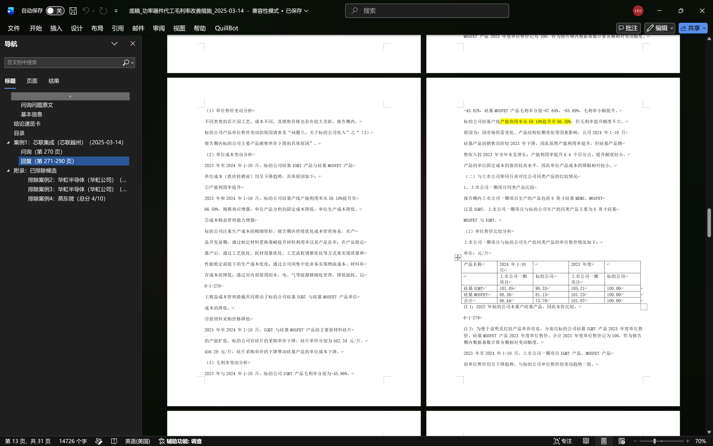
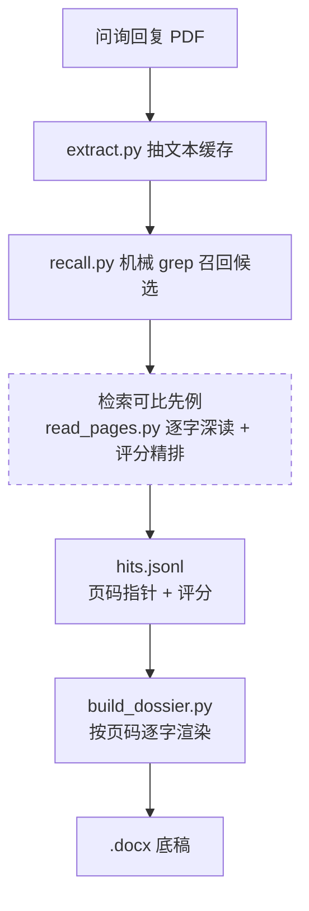

# IPO Inquiry Dossier

> 不写代码、没用过 GitHub 也没关系。想先快速看懂这个工具能做什么、长什么样，看这一页就够，不用安装任何东西：[从这里开始](从这里开始.md)。

**给 IPO 审核问询找可比公司的先例，按统一标准筛出能用的，再逐字取证，自动生成可直接粘贴进答复的底稿。**

做 IPO 项目时，最花时间的往往不是抄写，而是判断：先读懂一道审核问询到底在问什么，再到几家到十几家可比公司、每家好几份问询回复里翻找相关先例，然后一条条判断它是不是真的可比、能不能用。这些回复一份少则几十页、多则几百页，翻找本身就很费时间。方向理解错了，翻半天还得作废。

这个工具把最磨人的理解和检索压下来。你给它一批可比公司的问询回复 PDF 和一道题，它先理解题意、检索可能相关的先例、按统一标准打分初筛，再生成一份格式整齐、能直接粘贴的 `.docx` 底稿。引用由脚本按页码从源 PDF 逐字读出，一字不差、标好出处，不会被 AI 改写。你要做的是复核它挑出来的先例，而不是从零大海捞针。

## 为什么比人工好

| | 人工 | 这个技能 |
|---|---|---|
| 找可比先例 | 在多家公司、多份文件里反复读、反复判断，慢且容易看走眼 | 自动检索加按统一标准初筛，你只复核 |
| 引用与格式 | 电脑上复制粘贴，引用靠人核对、排版容易乱 | 脚本按页码逐字取证，一字不差、格式统一 |
| 判断标准 | 因人而异 | 统一评分标准，每步可回溯 |
| 耗时 | 一份三到五小时 | 几分钟 |

关键在于把**判断**和**取证**拆开：AI 只决定"哪些案例可比、抄哪几段"，而底稿正文由脚本按页码从源 PDF 逐字读出。既拿到 AI 的判断效率，又保住引用与原文一字不差、排版统一。

## 长文档带来的两难

问询回复一份少则几十页、多则几百页。人来做，要在这么多页里反复翻找、判断，慢且容易看漏；直接把整份文件丢给 AI，又会撑爆上下文，喂得越长越容易看漏、改写原文。这个工具把两头都解开：先把 PDF 抽取落盘，再用 grep 定位、按页码逐字取证，让文件体量和模型吃进的量解耦。文件几百页，模型也只碰命中的几行和页码指针，一份十页底稿约几千 token，而不是几十万。实测用 DeepSeek V4-Flash 跑完一份完整底稿，按官方定价算下来约 ¥0.3（绝大部分输入命中上下文缓存、按 ¥0.02/百万 token 计），单份成本几乎可以忽略。

## 给谁用

做 IPO 项目的投行人员，常要为一道审核问询找可比公司的先例：在多家可比公司、每家好几份问询回复里翻找、判断、复制粘贴，整理成可引用的底稿。这件事反复、费时、靠经验，还容易判断失准。这个工具把它变成可复用、可回溯的流程。

## 看效果



`examples/` 里有一份完整成品（[底稿_功率器件代工毛利率改善措施_2025-03-14.docx](examples/底稿_功率器件代工毛利率改善措施_2025-03-14.docx)）、对应的 `sample_hits.jsonl`（精排结果输入示范）和 `sample_ranking_report.jsonl`（含被丢弃候选的打分回溯）。建议先打开这份 docx 看产物长什么样。

## 拿 7 道真题实测过

不靠完整的标准答案，也能验证这套流程值不值得信。我拿 7 道真实的第一轮审核问询逐题跑了一遍，都是半导体 IPO 里偏难的题，涉及盈利预测、收入与客户、毛利率多个口径。每题单独用 DeepSeek V4-Flash 跑完，人民币按官方定价自己算。

| 看什么 | 结果 | 说明 |
|---|---|---|
| 找不找得到 | 7 题全部命中 | 每题都召回到分数过线、能用的可比先例 |
| 引用准不准 | 页码忠实度 100% | 保留先例的每条引用，翻到源文件那一页都一字不差 |
| 初筛判得对不对 | 63 条主题不符的候选全部正确挡掉 | 主题对不上的立即淘汰，判定没有出错 |
| 留下来的能不能用 | 15 条里 12 条经人工复核可用 | 另外 3 条主题相关但口径偏了，被我标成误留，没有藏着 |
| 花多少钱 | 7 题合计约 ¥2.08 | 平均每题约 ¥0.3，绝大部分输入命中上下文缓存 |
| 跑多久 | 平均约 5 分半一题 | 全程没有爆上下文 |

最值得说的是召回。有两题我人工一条先例都没翻到，工具各捞出一条确实能用的；也有一题工具漏掉了库里本来就有的一条可用先例。它既能补人工的盲点，也有自己的盲区，两头我都如实记下来了。所有被淘汰、被丢弃的候选都留在 `_work/ranking_report.jsonl` 里，可以逐条回看判得对不对。

## 怎么用

> 前提：这是给 Claude Code、Codex、Cursor 这类 coding agent 用的技能。没用过这类工具，看顶部那份说明就够，不必往下读。

**快速上手，三步：**

1. **装**——对你的 agent 说一句话，让它把 https://github.com/hhaa134323/ipo-inquiry-dossier 装到 `~/.claude/skills/` 下**并装好依赖**（建 `.venv`、按 `requirements.txt` 安装），一次装好、以后跑任务不用再装。本机没装 git 也没关系——下载由 agent 完成；想自己装见下方「安装」。
2. **放**——把可比公司的问询回复 PDF 放进任意一个目录。
3. **说**——告诉 agent：用 ipo-inquiry-dossier 帮我做底稿，PDF 在哪个目录、要回答哪道问询。剩下的它全自动跑完。

下面是更细的说明，平时不用全看。

### 安装

> 运行环境：开发与测试均在 **Python 3.12**；建议 **Python ≥ 3.9**（脚本只用标准库加 `pymupdf` / `python-docx`，3.9+ 均可运行）。动手前先用 `python --version` 确认一下。

依赖在**安装这一步**就装好（建 `.venv` + 按 `requirements.txt` 安装），任务运行阶段不再装，也不写进 `SKILL.md` 的工作流。

> 没装 git 也没关系：最省事是让 agent 替你装（下面「自然语言安装」），它会自己把仓库下载好；想自己动手又没有 git，用下面的「没有 git·下载 ZIP」即可，全程不碰命令行 git。

**自然语言安装（推荐，不用懂 git）** —— 直接对 agent 说：

> 把 https://github.com/hhaa134323/ipo-inquiry-dossier 这个 Claude Code 技能装到我的 `~/.claude/skills/` 下，建好 `.venv` 虚拟环境并按 `requirements.txt` 装好依赖。**只装环境、先别跑任务**：装完停下来告诉我安装结果就行，不要自动开始做底稿——做底稿是下一步，等我把 PDF 目录和要回答的问询发给你之后再开始（见下方「使用」）。

agent 会自己把仓库下载到技能目录，并在安装时一并建好 `.venv`、装好依赖（见下方「依赖」），之后跑任务直接用该环境，无需再装。你本机有没有 git 都行——下载由 agent 完成。

**手动安装 · 有 git** —— 自己 clone 并装好依赖：

```bash
# 1. 克隆到技能目录（全局，所有项目可用）
git clone https://github.com/hhaa134323/ipo-inquiry-dossier.git ~/.claude/skills/ipo-inquiry-dossier
cd ~/.claude/skills/ipo-inquiry-dossier
# 或项目级（仅当前项目）：克隆到 你的项目/.claude/skills/ipo-inquiry-dossier

# 2. 建虚拟环境并装依赖（macOS / Linux）
python -m venv .venv
.venv/bin/python -m pip install -r requirements.txt

# Windows
python -m venv .venv
.venv\\Scripts\\python.exe -m pip install -r requirements.txt
```

**手动安装 · 没有 git（下载 ZIP）** —— 不用装 git，从网页下载即可：

1. 打开 https://github.com/hhaa134323/ipo-inquiry-dossier ，点绿色的 **Code → Download ZIP**。
2. 解压，把文件夹**改名为 `ipo-inquiry-dossier`**（GitHub 下载的 ZIP 解压后通常叫 `ipo-inquiry-dossier-main`），放进技能目录。
 - macOS / Linux：`~/.claude/skills/`
 - Windows：`C:\\Users\\你的用户名\\.claude\\skills\\`
3. 打开终端进入该目录，建虚拟环境并装依赖：

```bash
# 进入解压放好的目录
cd ~/.claude/skills/ipo-inquiry-dossier

# macOS / Linux
python -m venv .venv
.venv/bin/python -m pip install -r requirements.txt

# Windows
python -m venv .venv
.venv\\Scripts\\python.exe -m pip install -r requirements.txt
```

> 这条路仍需要 Python（建虚拟环境、装依赖用）。装好 Python 后这几条命令复制粘贴即可；嫌麻烦就直接用上面的「自然语言安装」，让 agent 全程代劳（连 Python 环境也可以让它帮你装）。

也可用 `claude --add-dir /path/to/ipo-inquiry-dossier` 直接引用解压后的目录，无需拷贝；引用方式下首次使用前，同样需在该目录建好 `.venv` 并按上面装依赖。

**其他 coding agent（Codex / Gemini CLI / Cursor…）** —— 把仓库链接丢给它，让它从 **`SKILL.md`** 读起、按需加载 `docs/` 和 `scripts/`；有文件系统权限的也照上面装进自己的技能目录（有 git 用 clone，没有就下载 ZIP），并在安装时建好 `.venv`、装好依赖。

### 使用

装好后，用斜杠命令 `/ipo-inquiry-dossier`，或者直接像下面示例这样把需求说清楚：

> 我的可比公司问询回复 PDF 都放在 `<我放PDF的目录>`（换成你自己的真实路径，比如 Windows 写 `D:\\可比公司问询回复`，Mac/Linux 写 `~/可比公司问询回复`），底稿想输出到 `<输出目录>`。请用 ipo-inquiry-dossier 帮我做一份可比先例底稿，要回答的问询是：「<把要回答的那道审核问询原文粘到这里>」

 
 输入和输出路径的细节，一般不用管，agent 会自动带参数 

脚本用 `--input` 和 `--output` 两个参数控制，你只要把自己的目录路径告诉 agent，它会自动带上参数，不用自己敲。注意传的是你自己存放 PDF、想要产物的目录，不是 skill 安装目录里的子文件夹。

- **输入 PDF 目录** —— `--input`（简写 `-i`），放可比公司问询回复 PDF 的目录。脚本会递归扫描该目录下所有 `*.pdf`。Windows 例 `D:\\可比公司问询回复`；Mac/Linux 例 `~/可比公司问询回复` 或 `/Users/你的用户名/可比公司问询回复`。
- **输出 docx 目录** —— `--output`（简写 `-o`），底稿 docx 的输出目录，产物名形如 `底稿_{主题}_{日期}.docx`；**该目录只保留这一份最终 docx**，检索候选、`hits.jsonl`、精排报告、渲染截图等中间产物统一落到 `_work/` 子目录（默认 `{output}/_work`，可用 `--work` 改目录、`--hits` 单独指定 hits 路径）。Windows 例 `D:\\底稿输出`；Mac/Linux 例 `~/底稿输出`。

 

技能会：

1. 调 `extract.py --input ` 把 PDF 逐页抽成 `[PAGE n]` 文本缓存（脚本）；
2. 检索可比先例：`recall.py` 读口径词表机械 grep 召回候选、`read_pages.py` 按页码逐字读出原文，再按统一评分标准（rubric，5 个维度各 0–2 分）精排、产出 `hits.jsonl`（**口径扩展与打分这步靠 AI 判断**）；
3. 调 `build_dossier.py --input --output <输出目录>` 按页码逐字渲染出 `.docx` 底稿（脚本）。

你全程只提供 PDF 和问题、告诉 agent 文件放在哪，不用自己敲命令、不用装依赖。

## 依赖（安装时装好）

依赖只有 `pymupdf` 和 `python-docx`，在**安装 skill 时**一次性装进 `.venv`（见上方「安装」），**使用者不用在跑任务时手动装**。安装阶段建好 `.venv` 并把依赖装进去，之后统一用该 venv 的解释器跑脚本（跨平台，不引入 uv 之类额外工具）。这部分**不写进 `SKILL.md` 的工作流**，避免每次任务都掺进安装逻辑。脚本其余只用 `pathlib` 和标准库，Windows / macOS / Linux 一致运行。

| 包 | 用途 |
|---|---|
| `pymupdf` | PDF 逐页抽文本、检表格、按页渲染 PNG |
| `python-docx` | 生成 .docx 底稿、关键锚点黄色高亮 |

## Skill 结构

```
ipo-inquiry-dossier/
├── SKILL.md              技能入口（name/description 自动触发；工作流 + 规则）
├── docs/
│   ├── METHODOLOGY.md    方法论唯一事实源（召回、精排 rubric、hits 契约、渲染规则）
│   └── sample.png        示例底稿截图
├── scripts/
│   ├── extract.py        PDF 抽取为 [PAGE n] 文本缓存
│   ├── recall.py         读 term_map 机械 grep，召回候选到 _work/
│   ├── read_pages.py     按页码从缓存逐字读出原文
│   └── build_dossier.py  hits.jsonl + PDF 渲染为 .docx
├── examples/             成品 docx + hits / 精排报告样例
└── requirements.txt      pymupdf, python-docx
```

技能用**渐进式披露**：agent 先读 `SKILL.md` 拿到全局地图，其余文件按需加载。

| 文件 | 作用 | 何时加载 |
|---|---|---|
| `SKILL.md` | 工作流 + 规则 | 总是（技能触发时） |
| `docs/METHODOLOGY.md` | 方法论唯一事实源 | 召回 / 精排 / 写 hits 时 |
| `scripts/extract.py` | PDF → 文本缓存 | 步骤 1 |
| `scripts/recall.py` | 机械 grep 召回候选 | 召回 |
| `scripts/read_pages.py` | 按页码逐字读原文 | 精排深读 |
| `scripts/build_dossier.py` | 渲染 .docx | 步骤 3 |
| `examples/` | 成品 + hits 格式样例 | 想看产物或对照格式时 |
| `requirements.txt` | 依赖清单 | 安装 skill 时 |

## 设计要点

### 引用逐字可溯，不被 AI 改写
- PDF 正文由 `extract.py`（PyMuPDF）一次性抽成带 `[PAGE n]` 标记的 `.txt` 缓存。
- AI 只决定"抄哪些"并记下页码指针；渲染时由 `build_dossier.py` 按页码直接从 PDF 逐字读出——引用与原文一字不差，也不进 AI 上下文被改写。

### 召回与精排两段分离（AI 负责的部分）
- 召回：从问题原文拆限定词，做同义 / 口径扩展（AI 写 `_work/term_map.jsonl`），再由 `recall.py` 机械 grep 扫缓存，高召回不取舍。
- 精排：粗到细级联。闸一用 `read_pages.py` 只读问询题目打 A/B 维度，主题不符（维度 A=0）立即淘汰、不读回复；幸存者再 grep 定位、用 `read_pages.py` 逐字精读回复打 C/D/E（不为省 token 裁剪深读窗口）。rubric 就是这张"打分表"，5 个维度——同问询实质、真问询先例、产品行业可比、口径一致、可借鉴——每个维度 0–2 分；总分达 7 分且没有 0 分项才保留。这保证不同问题、不同人用同一把尺子；省 token 主要靠闸一挡掉大量无关候选。
- 所有候选（含闸一淘汰、闸二丢弃的）记录在 `_work/ranking_report.jsonl`，每步判断可回溯。

### 脚本确定性渲染 docx
- 结论速览卡 / 五级溯源表 / 关键锚点自动标黄 / 表格三级兜底（真表格→截图→段落）/ 自动目录（Word 右键"更新域"）。

## 工作流

虚线框是 **AI 判断**的环节，实线框是**脚本确定性执行**：



AI 只出现在中间那一步（决定哪些案例可比、抄哪几段）；两端的抽取和渲染都是脚本确定性完成，不经模型。

## 引用纪律

- 引用一律逐字落盘，绝不让 AI 改写；
- 每条结论落到"文件 + 页码"；
- 找不到就说找不到，严禁编造。

方法论完整细节见 [docs/METHODOLOGY.md](docs/METHODOLOGY.md)。
