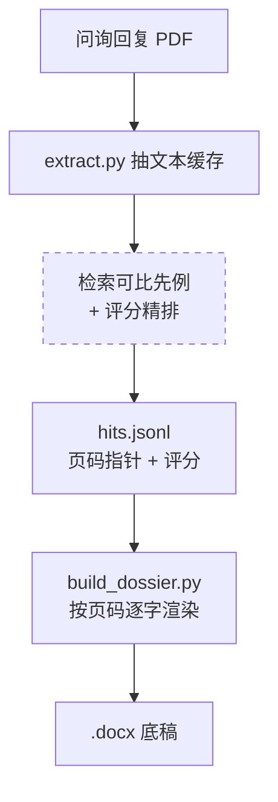

# IPO Inquiry Dossier

中文名 **可比案例底稿** —— 检索可比上市公司的问询先例，逐字取证，整理成可直接粘贴进答卷的底稿。

**把投行人工要做三到五小时的可比案例底稿，交给 agent 几分钟跑完——而且比手工更可靠。**

你给它几份问询回复 PDF 和一道题，它检索可比上市公司的问询先例、按统一标准精排、整理成一份可直接粘贴进答卷的 `.docx` 底稿。每一句引用都和原 PDF 一字不差、标好出处页码，不会被 AI 改写。

## 为什么比人工好

| | 人工 | 这个技能 |
|---|---|---|
| 耗时 | 一份三到五小时 | 几分钟 |
| 格式与溯源 | 复制粘贴，排版参差、页码易漏 | 统一格式，每条都标好「文件 + 页码」 |
| 判断标准 | 因人而异 | 统一评分标准（见下「设计要点」），每步可回溯 |
| token 成本 | — | 原文不进模型，与底稿篇幅解耦 |

关键在于把**判断**和**取证**拆开：AI 只决定“哪些案例可比、抄哪几段”，而底稿正文由脚本按页码从源 PDF 逐字读出。既拿到 AI 的判断效率，又保住引用与原文一字不差、排版统一。

## 给谁用

做 IPO 项目的投行、证券研究人员，常要为某个审核问询问题找可比上市公司的先例：翻它们的问询回复、逐字抄录对应段落、整理成可引用的底稿。这件事反复、费时、易出错，质量还靠人盯。这个技能把它变成可复用、可回溯的流程。

## 看效果


`examples/` 里有一份完整成品（[底稿_功率器件代工毛利率改善措施_2025-03-14.docx](examples/底稿_功率器件代工毛利率改善措施_2025-03-14.docx)）、对应的 `sample_hits.jsonl`（精排结果输入示范）和 `sample_ranking_report.jsonl`（含被丢弃候选的打分回溯）。建议先打开这份 docx 看产物长什么样。

## 怎么用

这是个 coding-agent 技能，需要一个能读文件、跑命令的 agent（Claude Code / Codex / Gemini CLI / Cursor 等）。不需要你自己敲命令。

### 安装

**自然语言安装（推荐）** —— 直接对 agent 说：

> 把 https://github.com/hhaa134323/ipo-inquiry-dossier 这个 Claude Code 技能克隆到我的 `~/.claude/skills/` 下，然后用它帮我做一份可比案例底稿。

agent 会自己 `git clone` 到技能目录，首次运行时还会自动建好运行环境（见下方「依赖」）。

**手动安装（Claude Code）** —— 自己 clone：

```bash
# 全局（所有项目可用）
git clone https://github.com/hhaa134323/ipo-inquiry-dossier.git ~/.claude/skills/ipo-inquiry-dossier

# 或项目级（仅当前项目）
git clone https://github.com/hhaa134323/ipo-inquiry-dossier.git 你的项目/.claude/skills/ipo-inquiry-dossier
```

也可用 `claude --add-dir /path/to/ipo-inquiry-dossier` 直接引用，无需拷贝。

**其他 coding agent（Codex / Gemini CLI / Cursor…）** —— 把仓库链接丢给它，让它从 **`SKILL.md`** 读起、按需加载 `docs/` 和 `scripts/`；有文件系统权限的也可照上面装进自己的技能目录。

### 使用

装好后用斜杠命令或自然语言触发：

- 斜杠命令（Claude Code）：`/ipo-inquiry-dossier`
- 自然语言触发（说到这些会自动用上）：
  - “找家可比上市公司的问询回复，帮我做一份毛利率分析的答题底稿”
  - “把这几份审核问询回复 PDF 整理成可直接粘贴的底稿”

示例：

> 我在 `~/Desktop/可比公司pdf` 放了几份问询回复，请用 ipo-inquiry-dossier 帮我找可比案例、做一份毛利率分析的底稿。

**输入 / 输出路径**（脚本用 `--input` 和 `--output` 两个参数控制，你只要把目录告诉 agent，它会自动带上参数，不用自己敲）：

- **输入 PDF 目录** —— `--input`（简写 `-i`），默认 `./input`。脚本会递归扫描该目录下所有 `*.pdf`，把你的问询回复 PDF 放进去即可。
- **输出 docx 目录** —— `--output`（简写 `-o`），默认 `./output`。底稿写到这里，文件名形如 `底稿_{主题}_{日期}.docx`；同目录还会落一份 `hits.jsonl`（精排结果，必要时可用 `--hits` 单独指定路径）。

技能会：

1. 调 `extract.py --input <PDF目录>` 把 PDF 逐页抽成 `[PAGE n]` 文本缓存（脚本）；
2. 检索可比先例，按统一评分标准（rubric，5 个维度各 0–2 分）精排、产出 `hits.jsonl`（**这步靠 AI 判断**）；
3. 调 `build_dossier.py --input <PDF目录> --output <输出目录>` 按页码逐字渲染出 `.docx` 底稿（脚本）。

你全程只提供 PDF 和问题、告诉 agent 文件放在哪，不用自己敲命令、不用装依赖——上面的路径默认值只是方便你检查产物落在哪个目录。

## 依赖（首次自动装）

依赖只有 `pymupdf` 和 `python-docx`，**使用者不用手动装**。`SKILL.md` 里写了「首次运行自动建 venv + 装依赖」：agent 第一次跑时会建一个 `.venv` 并把依赖装进去，之后统一用该 venv 的解释器跑脚本（跨平台，不引入 uv 之类额外工具）。脚本只用 `pathlib` 和标准库，Windows / macOS / Linux 一致运行。

## Skill 结构

```
ipo-inquiry-dossier/
├── SKILL.md              技能入口（name/description 自动触发；工作流 + 规则）
├── docs/
│   ├── METHODOLOGY.md    方法论唯一事实源（召回、精排 rubric、hits 契约、渲染规则）
│   └── sample.png        示例底稿截图
├── scripts/
│   ├── extract.py        PDF 抽取为 [PAGE n] 文本缓存
│   └── build_dossier.py  hits.jsonl + PDF 渲染为 .docx
├── examples/             成品 docx + hits / 精排报告样例
└── requirements.txt      pymupdf, python-docx
```

技能用**渐进式披露**：agent 先读 `SKILL.md` 拿到全局地图，其余文件按需加载。

| 文件 | 作用 | 何时加载 |
|---|---|---|
| `SKILL.md` | 工作流 + 规则 | 总是（技能触发时） |
| `docs/METHODOLOGY.md` | 方法论唯一事实源 | 召回 / 精排 / 写 hits 时 |
| `scripts/extract.py` | PDF → 文本缓存 | 步骤 1 |
| `scripts/build_dossier.py` | 渲染 .docx | 步骤 3 |
| `examples/` | 成品 + hits 格式样例 | 想看产物或对照格式时 |
| `requirements.txt` | 依赖清单 | 首次装依赖时 |

## 设计要点

### 引用逐字可溯，不被 AI 改写
- PDF 正文由 `extract.py`（PyMuPDF）一次性抽成带 `[PAGE n]` 标记的 `.txt` 缓存。
- AI 只决定“抄哪些”并记下页码指针；渲染时由 `build_dossier.py` 按页码直接从 PDF 逐字读出——引用与原文一字不差，也不进 AI 上下文被改写。
- 顺带的好处：token 消耗与底稿篇幅解耦，一份十页底稿约几千 token，而非几十万。

### 召回与精排两段分离（AI 负责的部分）
- 召回：从问题原文拆限定词，做同义 / 口径扩展，机械 grep 扫缓存，高召回不取舍。
- 精排：逐个候选按一套固定的**评分标准（rubric）**打分。rubric 就是这张“打分表”，5 个维度——同问询实质、真问询先例、产品行业可比、口径一致、可借鉴——每个维度 0–2 分；总分达 7 分且没有 0 分项才保留。这保证不同问题、不同人用同一把尺子。
- 所有候选（含丢弃的）记录在 `ranking_report.jsonl`，每步判断可回溯。

### 脚本确定性渲染 docx
- 结论速览卡 / 五级溯源表 / 关键锚点自动标黄 / 表格三级兜底（真表格→截图→段落）/ 自动目录（Word 右键“更新域”）。

## 工作流

虚线框是 **AI 判断**的环节，实线框是**脚本确定性执行**：



AI 只出现在中间那一步（决定哪些案例可比、抄哪几段）；两端的抽取和渲染都是脚本确定性完成，不经模型。

## 引用纪律

- 引用一律逐字落盘，绝不让 AI 改写；
- 每条结论落到“文件 + 页码”；
- 找不到就说找不到，严禁编造。

方法论完整细节见 [docs/METHODOLOGY.md](docs/METHODOLOGY.md)。
