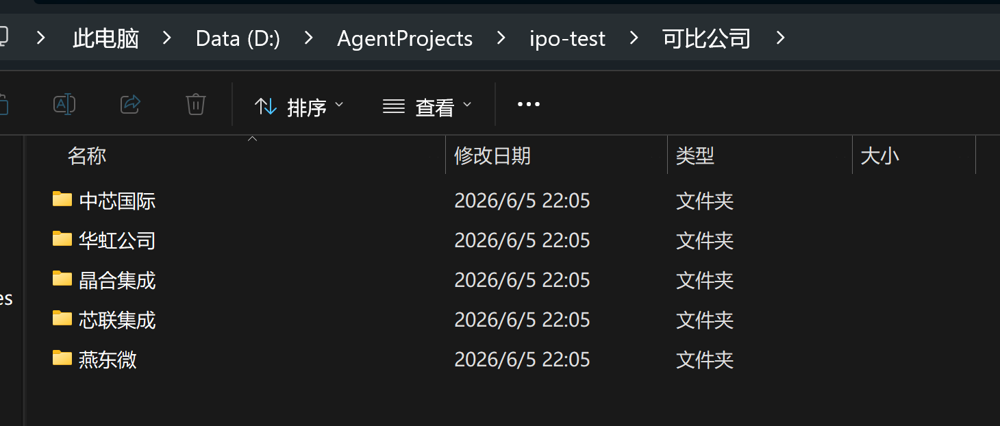
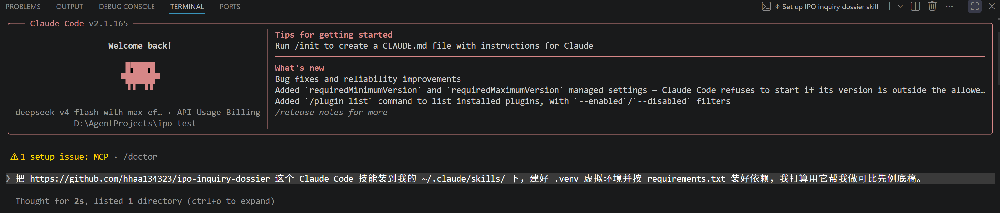
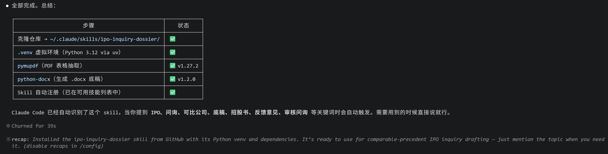
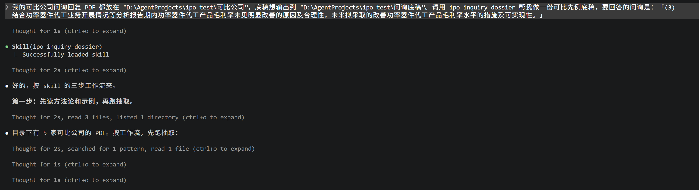
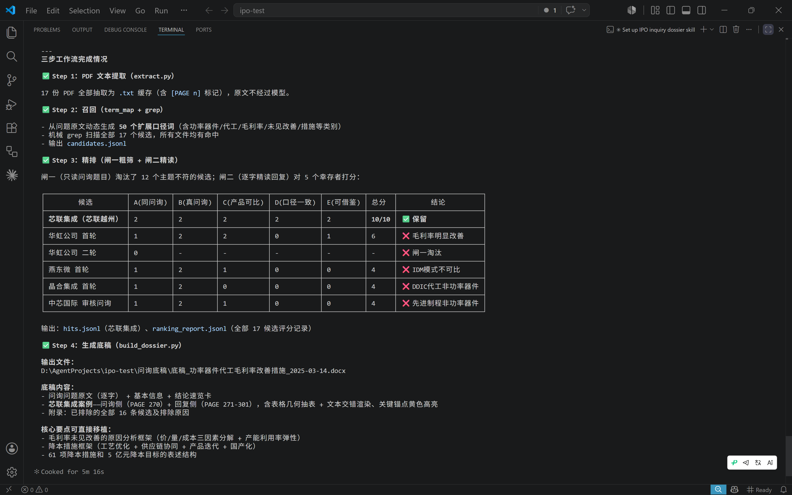

# 先看这里

写给想快速了解或者评估这个工具的人。不用装任何东西,也不用懂代码,看完这一页就够。

## 它解决什么

做 IPO 项目时,最花时间的往往不是抄写,而是判断。你得先读懂一道审核问询到底在问什么,再到一堆问询回复文件里翻找可能相关的先例,然后一条条判断它是不是真的可比、能不能用。方向理解错了,翻半天的材料还得作废。等到整理成稿,格式又常常乱成一团。

这个工具帮你把最磨人的理解和检索环节压下来。你给它几份问询回复 PDF 和一道题,它会先理解题意,检索可能相关的先例,按统一标准给每条打分初筛,再生成一份格式整齐、能直接粘贴的 .docx 底稿。你要做的是复核它挑出来的先例,而不是从零开始大海捞针。

## 为什么可靠

它把判断和取证两件事分开了。AI 负责最耗时的那块,也就是理解题意、检索先例、判断哪些可比。具体的引用正文则由脚本按页码直接从 PDF 里逐字读出,原文不进 AI。

这样做有两个好处。一是引用一字不差,不会出现 AI 把原文改写或者凭空编造的情况。二是格式统一,省掉人工整理时最常见的格式混乱。判断这一步它只替你做初筛,最终是否采用仍由你把关。

## 先看成品

不用装任何东西,直接看就行。成品长这样:

完整的成品文件在这里,点开后右上角可以下载查看:

[底稿_功率器件代工毛利率改善措施_2025-03-14.docx](examples/底稿_功率器件代工毛利率改善措施_2025-03-14.docx)

## 想看它实际怎么跑

下面用一个真实例子,一步步走一遍。

### 第一步:把文件放好

按可比公司分文件夹。先建一个总文件夹(比如“可比公司”),再给每家公司单独建一个以公司名命名的子文件夹,把这家公司的问询回复 PDF 放进去就行。要新增一家可比公司,照样新建文件夹丢进 PDF,不用动任何代码或配置。

### 第二步:把它装好

装这一步不用自己敲命令。在你的 AI 编程助手(比如 Claude Code)里,用大白话告诉它:把这个 GitHub 仓库当作技能装到 ~/.claude/skills/ 下,建好 .venv 虚拟环境,按 requirements.txt 装好依赖。

它会自己把仓库拉下来,配好 Python 环境,装上 pymupdf、python-docx 这些依赖,再把技能注册好。装完会列一张清单,告诉你每一步的状态。注册好以后,你之后只要在对话里提到 IPO、问询、可比公司、底稿这些词,它就会自动用上这个技能,不用每次手动调。

### 第三步:让它跑一遍

文件放好、技能装好之后,剩下的就是发一句话告诉它:你的可比公司 PDF 放在哪个文件夹,以及这次要回答的问询题目是什么。题目直接从招股书或者反馈意见里整段粘过来就行。

接下来它会按固定的四步往下跑,你不用盯着。先把所有 PDF 抽成文本,再按题意生成检索口径、机械召回候选,然后分两道闸打分(第一道按主题粗筛,第二道逐字精读回复),最后把留下来的先例生成一份 .docx 底稿。引用正文按页码逐字抄,关键句还会高亮标出来。

## 想自己用

这是给 AI 编程助手用的技能,比如 Claude Code 或者 Cursor。如果你平时就用这类工具,直接看 README 里讲怎么用的那一节,不用自己敲命令。如果没用过,看上面的成品和走查就够了,不必折腾安装。
